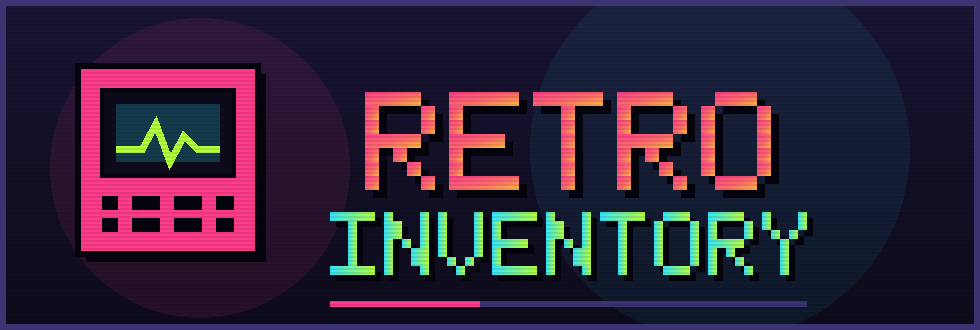

<p align="center">
  
</p>

<p align="center">
  <b>A pixel-art collection tracker for retro games and consoles.</b><br>
  Vue 3 single-page app, served as a single self-contained Rust binary.
</p>

<p align="center">
  
  
  
  
  
</p>

---

## What it is

Retro Inventory is a personal collection manager for retro video games and hardware. It tracks
what you own, what you paid, what it is worth today, and how that value has moved over time —
all wrapped in a CRT-flavoured, 2D pixel-art interface.

The whole UI is compiled into the Rust binary at build time (via
[`rust-embed`](https://crates.io/crates/rust-embed)), so deploying the app means shipping **one
executable** with no assets folder, no reverse proxy config and no Node runtime.

> **Project status:** the collection data currently lives in a mocked REST client in the browser
> (backed by `localStorage`). The Rust side is a static-asset server today; the API layer
> (`src/adapter/backend_api.rs`, `src/application/`) is scaffolded but empty. See
> [Roadmap](#roadmap).

## Features

### 📊 Dashboard

- **Portfolio stat cards** — collection value, games value, hardware value, total invested and
  unrealised profit with ROI.
- **Value trend chart** — monthly history of the whole collection, split into software and
  hardware, with selectable time ranges.
- **Breakdowns** — value by platform and value by genre, rendered as pixel bar lists.
- **Trending up / down** — the five biggest 12-month gainers and losers, each with a sparkline.
- **Live ticker bar** — a scrolling marquee of price movements across the collection.

### 🕹 Games library

- Search by title or publisher, filter by console and genre.
- Sort by value, name, release year, date added or profit.
- Live "x / y shown" counter plus visible value and visible profit totals for the current filter.
- Per-title cards with cover art, condition, market price and profit vs. buy price.

### 📺 Console shelf

- One card per platform with its own accent colour, hardware value, linked game count and the
  combined value of everything on that platform.
- Search and sort by value, library size, name or release year.
- Deleting a console also removes the games attached to it.

### 🎨 Artwork & extras

- **Image uploads** with drag & drop, client-side downscaling (720×960 for covers, 960×720 for
  consoles), JPEG re-encoding and a 12 MB input cap.
- **Generated pixel cover art** — titles without artwork get deterministic pixel art derived from
  their name, so the shelf never looks empty.
- **Graceful storage limits** — if a write would blow the `localStorage` quota, the in-memory
  store is rolled back and a toast explains what happened.
- **Toast notifications**, modal shells, loading screens and empty states, all in the same
  pixel-art design language.

## Screens

| Route | View | Purpose |
| --- | --- | --- |
| `/` | [`DashboardView.vue`](frontend/src/views/DashboardView.vue) | Portfolio value, trends and movers |
| `/library/games` | [`GamesView.vue`](frontend/src/views/GamesView.vue) | Searchable, filterable game shelf |
| `/library/consoles` | [`ConsolesView.vue`](frontend/src/views/ConsolesView.vue) | Hardware overview per platform |
| _anything else_ | — | Redirects to `/` |

## Tech stack

| Layer | Technology |
| --- | --- |
| Backend | Rust 2024, [Axum](https://github.com/tokio-rs/axum) 0.8 on Tokio |
| Asset embedding | `rust-embed` + `mime_guess` |
| Logging | `tracing` / `tracing-subscriber` (JSON formatter) |
| Config | `dotenvy` (`.env` support) |
| Frontend | Vue 3 (`<script setup>` SFCs), TypeScript, Vite 8 |
| State | Pinia |
| Routing | Vue Router (HTML5 history mode) |
| Charts | Hand-rolled SVG components — no charting dependency |

## Architecture

```
┌──────────────────────────── retro-inventory (single binary) ────────────────────────────┐
│                                                                                         │
│   Axum router                          rust-embed                                       │
│   ├── GET /            ──────────────▶ index.html            (Cache-Control: no-cache)  │
│   └── GET /{*path}     ──────────────▶ frontend/dist/*       (immutable, max-age=1y)    │
│                                        └── miss + no "." ──▶ index.html (SPA fallback)  │
│                                        └── miss + "."    ──▶ 404                        │
│                                                                                         │
└─────────────────────────────────────────────────────────────────────────────────────────┘
                                          ▲
                                          │  frontend/dist is embedded at compile time
                                          │
        ┌─────────────────────────────────┴─────────────────────────────────┐
        │  Vue 3 SPA                                                        │
        │  views ─▶ Pinia store (library.ts) ─▶ api/client.ts (mock REST)   │
        │                                          └─▶ localStorage + seed  │
        └───────────────────────────────────────────────────────────────────┘
```

Because assets are embedded, **the frontend must be built before the backend compiles** — the
`frontend/dist` folder has to exist for the `RustEmbed` derive to succeed.

### Serving rules

| Request | Response |
| --- | --- |
| `GET /` | `index.html`, `Cache-Control: no-cache` |
| `GET /assets/app-a1b2c3.js` | Embedded file with guessed MIME type, `Cache-Control: public, max-age=31536000, immutable` |
| `GET /library/games` | `index.html` — client-side routing takes over |
| `GET /missing.png` | `404 Not Found` (paths containing a `.` are treated as assets) |

## Project structure

```
retro-inventory/
├── assets/
│   └── logo.svg                 # Project logo
├── src/                         # Rust backend
│   ├── main.rs                  # Entry point: router, listener, JSON logging
│   ├── lib.rs
│   ├── adapter/
│   │   ├── web_frontend.rs      # Embedded SPA serving + cache headers
│   │   └── backend_api.rs       # (reserved for the REST API)
│   └── application/             # (reserved for domain/use-case logic)
├── frontend/                    # Vue 3 + TypeScript SPA
│   ├── src/
│   │   ├── views/               # Dashboard, Games, Consoles
│   │   ├── components/          # Cards, modals, charts, toasts, nav
│   │   ├── composables/         # Formatting, image upload, cover art, toasts
│   │   ├── stores/library.ts    # Pinia store: totals, breakdowns, movers
│   │   ├── api/                 # Mock REST client + seed database
│   │   ├── types/               # Shared domain types
│   │   └── styles/retro.css     # Design tokens & pixel-art component styles
│   └── vite.config.ts
├── Cargo.toml
└── Makefile
```

## Getting started

### Prerequisites

- [Rust](https://rustup.rs/) 1.85+ (the crate uses edition 2024)
- [Node.js](https://nodejs.org/) 20+ and npm

### 1. Install frontend dependencies

```bash
cd frontend
npm install
```

### 2. Frontend-only development (hot reload)

```bash
cd frontend
npm run dev
```

Vite serves the app on <http://localhost:5173> with hot module replacement. This is the fastest
loop for UI work — the mock API means no backend is required.

### 3. Full build (embedded, production-like)

```bash
cd frontend && npm run build && cd ..   # produces frontend/dist
cargo run                               # embeds dist, serves on :8080
```

Then open <http://localhost:8080>.

Rebuilding the frontend requires recompiling the backend for the new assets to be embedded in a
release build. In debug builds `rust-embed` reads from disk at runtime, so a plain `npm run build`
is usually enough to see changes after a refresh.

### Make targets

```bash
make help            # list available targets
make build-frontend  # npm run build inside frontend/
make build-backend   # cargo build
make build-all       # frontend, then backend
```

## Configuration

| Variable | Default | Effect |
| --- | --- | --- |
| `RUST_LOG` | `INFO` | Standard `tracing` filter, e.g. `RUST_LOG=debug,tower_http=trace` |

A `.env` file in the repository root is loaded automatically at startup (via `dotenvy`). Logs are
emitted as JSON on stdout. The listen address is currently fixed at `0.0.0.0:8080`.

## Data model

```ts
interface Game {
  id: string
  name: string
  releaseYear: number
  publisher: string
  genre: Genre            // Platformer | RPG | Shoot 'em up | Fighting | Racing | ...
  marketPrice: number     // estimated value today, EUR
  buyPrice: number        // what the collector actually paid, EUR
  consoleId: string       // owning platform
  coverUrl?: string       // falls back to generated pixel art
  condition: Condition    // Loose | Complete in box | Sealed
  addedAt: string         // ISO date
  priceHistory: PricePoint[]
}

interface GameConsole {
  id: string
  name: string
  shortName: string
  manufacturer: string
  releaseYear: number
  marketPrice: number
  buyPrice: number
  condition: Condition
  color: string           // accent colour used across the UI
  imageUrl?: string
  addedAt: string
  priceHistory: PricePoint[]
}

interface PricePoint {
  date: string            // ISO month, e.g. 2025-03-01
  value: number
}
```

## The mock API

[`frontend/src/api/client.ts`](frontend/src/api/client.ts) emulates a REST backend: every call
resolves against an in-memory database after a simulated ~320 ms round-trip, and persists to
`localStorage` under the key `retro-inventory/db/v2`.

| Method | Emulated endpoint |
| --- | --- |
| `listGames()` | `GET /api/games` |
| `listConsoles()` | `GET /api/consoles` |
| `listPriceHistory()` | `GET /api/price-history` |
| `createGame(payload)` | `POST /api/games` |
| `createConsole(payload)` | `POST /api/consoles` |
| `updateGameCover(id, url)` | `PATCH /api/games/:id/cover` |
| `updateConsoleImage(id, url)` | `PATCH /api/consoles/:id/image` |
| `deleteGame(id)` | `DELETE /api/games/:id` |
| `deleteConsole(id)` | `DELETE /api/consoles/:id` |
| `resetCollection()` | — restores the shipped demo collection |

The seed database ships with nine classic platforms (NES, SNES, Mega Drive, Game Boy,
PlayStation, Nintendo 64, Saturn, Dreamcast, Neo Geo AES) and a shelf of era-defining titles,
each with several years of monthly price history. **Reset demo data** on the dashboard restores
it at any time.

Swapping in the real backend later means replacing this single module — the Pinia store and the
views only talk to the `api` object.

## Design system

The look is defined by design tokens in
[`frontend/src/styles/retro.css`](frontend/src/styles/retro.css): a deep indigo canvas, hard
black drop shadows instead of blurs, 4px radii and neon accents.

| Token | Value | Usage |
| --- | --- | --- |
| `--bg` / `--bg-deep` | `#0d0b1a` / `#070611` | Canvas |
| `--panel` … `--panel-3` | `#191534` → `#2c2656` | Cards and surfaces |
| `--magenta` | `#ff3d8b` | Primary accent |
| `--cyan` | `#34e6ff` | Software / secondary accent |
| `--lime` | `#b6ff3d` | Positive trends |
| `--amber` | `#ffbf3d` | Hardware accent |
| `--danger` | `#ff5b5b` | Negative trends, destructive actions |
| `--font-display` | Press Start 2P | Headings and the wordmark |
| `--font-body` | Space Grotesk | Body copy |
| `--font-mono` | JetBrains Mono | Prices, counters, tickers |

The logo in [`assets/logo.svg`](assets/logo.svg) uses the same palette and is drawn entirely from
pixel rectangles, so it stays crisp at any size.

## Roadmap

- [ ] Real REST API in `src/adapter/backend_api.rs` mirroring the mock client
- [ ] Domain and use-case layer in `src/application/`
- [ ] Persistent storage instead of `localStorage`
- [ ] Automated price history ingestion from a market data source
- [ ] Configurable listen address and port
